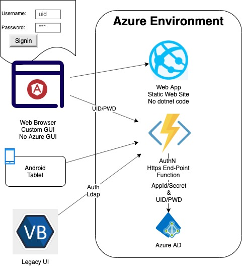

# Azure AD Authentication Service

## Objectives



* An end-point where a client app can send username and password to
* In case of a success a token is issued that can be used for other calls
* The end-point can be used from any type of client capable of Http request

## TODO:

* Add functionality to refresh `access_token` using `refresh_token`

## Authentication Function

Reference: https://docs.microsoft.com/en-us/graph/auth-v2-user

### Request

* Verb: POST 
* Route: `/`
* Body:
```
{
  "username": "azure-ad email address",
  "password": "azure-ad password"
}
```

### Response Success

* Status Code: 200
* Body:
```
{
  "token_type": "Bearer",
  "access_token": "long-string,
  "scope": "User.Read profile openid email",
  "ext_expires_in": "3599",
  "refresh_token": "long -string",
  "id_token": "long-string"
}
```

### Response Invalid Username/Password

* Status Code: 401
* Body:
```
{
   "message": "Invalid username and/or password"
}

### Response Bad Request

* Status Code: 400
* Body:
```
{
   "message": "Missing username and/or password"
}
```

### Response Intermittent Error

* Status Code: 429
* Body:
```
{
   "message": "Error occurred retrieving token"
}

## Setup on [Visual Studio Online](https://online.visualstudio.com/)

* [Reference](https://docs.microsoft.com/en-us/azure/azure-functions/functions-create-first-azure-function-azure-cli)
* Install [Azure Functions Core Tools](https://docs.microsoft.com/en-us/azure/azure-functions/functions-run-local#v2):
```
curl https://packages.microsoft.com/keys/microsoft.asc | gpg --dearmor > microsoft.gpg
sudo mv microsoft.gpg /etc/apt/trusted.gpg.d/microsoft.gpg
sudo sh -c 'echo "deb [arch=amd64] https://packages.microsoft.com/repos/microsoft-ubuntu-bionic-prod bionic main" > /etc/apt/sources.list.d/dotnetdev.list'
sudo apt-get update
sudo apt-get install azure-functions-core-tools -y
```
* Login to az cli: `az login`
* One time per Azure subscription configuration and resources:
```
namePrefix=authpoc
nameResourceGroup=${namePrefix}-resource-group
nameStorageAccount=${namePrefix}storage
location=centralus
az group create --name $nameResourceGroup --location $location
az storage account create --name $nameStorageAccount --location $location --resource-group $nameResourceGroup
```
* Create function:
```
az functionapp create --resource-group $nameResourceGroup --consumption-plan-location $location \
--name trgos-authentication --storage-account  $nameStorageAccount --runtime dotnet
```

## Development

* Clone the repo
* Modify the code
* Publish the function from AuthN folder: `func azure functionapp publish trgos-authentication --dotnet-cli-params -- "--configuration Release"`
* [Access function logs](https://markheath.net/post/three-ways-view-error-logs-azure-functions)
* Advanced logging future [options](https://stackify.com/logging-azure-functions/)

## Azure AD Setup

* Proceed to Azure AD from Azure Portal
* Register a new application: `Add your own application`
* Select a `native/desktop application` instead of the default web application
* Copy `Application Client ID` you will need it to configure the function variables
* Select `View API Permissions`
* Select `Grant Admin Consent`
* There is a delay until consent is granting, wait for the green icon before proceeding
* Select `Authentication` on the left hand menu
* Select `Certificates & Secrets` from the left hand
* Generate a new client secret and save it in a save place - you won't see it ever again

## Function Configuration

* In order to authenticate against active directory, client id and secret will be required
* These two are stored in env variables
* To configure the environment variables for existing function:
```
az functionapp config appsettings set --name trgos-authentication --resource-group authpoc-resource-group \
   --settings "AppClientID=--app client id--" \
   --settings "ClientSecret=--client-secret--"
```
* To configure [CORS](https://docs.microsoft.com/en-us/azure/azure-functions/functions-how-to-use-azure-function-app-settings#cors):
```
az functionapp cors remove -g authpoc-resource-group -n trgos-authentication --allowed-origins

az functionapp cors add --name trgos-authentication \
--resource-group authpoc-resource-group \
--allowed-origins "*"
```

## To test the deployment

* Create a user or two using Azure AD Portal
* Post a request as if from a server-side:
```
curl -XPOST -H "content-type:application/json" https://trgos-authentication.azurewebsites.net/api/authenticate -d '{
   "username": "email address",
   "password": "password"
}'
```
* Post a request using https://restninja.io/ (or alike) to simulate a browser request
* To verify the access token run:
`curl -XGET -H "Authorization:Bearer {access_token}" https://graph.microsoft.com/v1.0/me`
* Expected response:
```
{
  "@odata.context": "https://graph.microsoft.com/v1.0/$metadata#users/$entity",
  "businessPhones": [],
  "displayName": "Call Taker 1",
  "givenName": null,
  "jobTitle": null,
  "mail": null,
  "mobilePhone": null,
  "officeLocation": null,
  "preferredLanguage": null,
  "surname": null,
  "userPrincipalName": "call.taker.1@trgos.onmicrosoft.com",
  "id": "2e2ad39d-a79d-4479-813e-348a9460bbc7"
}
```